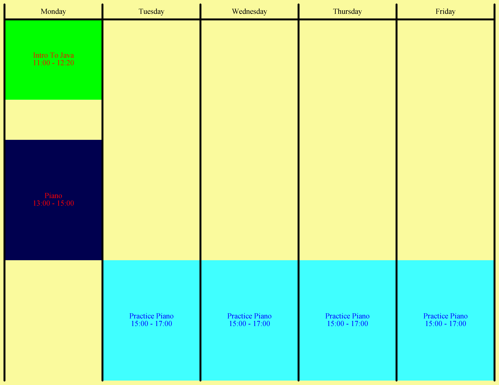

# Calendar

## Usage

Create an input file following your weekly schedule and the example provided. Modify the java to link to your input file and to change any specifics, such as paper size, output DPI, etc. 

## Input File Format

```
FOREGROUND_COLOR BACKGROUND_COLOR
category FG BG
... (as many categories as you need, duplicates not allowed)

Event
category of the event
number of occurrences each week
day1 start_time end_time (all in military time, without the colon).
... As many days/times as listed.

Another Event
...

```

Overlapping events will be taken care of such that the later in the input file it is given, and the later in the event, the higher it will be when drawn.


